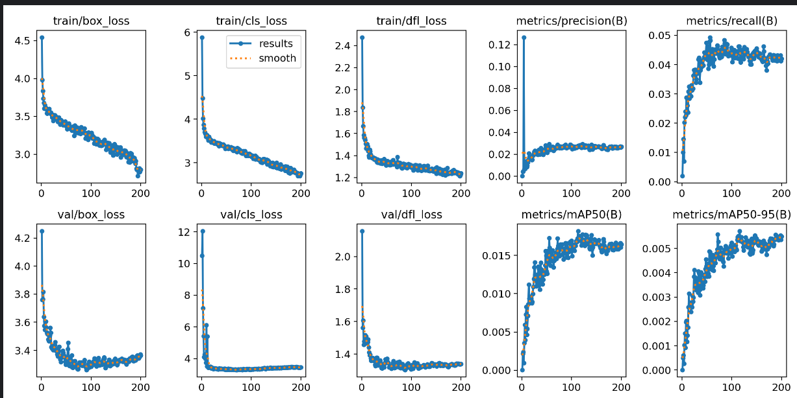
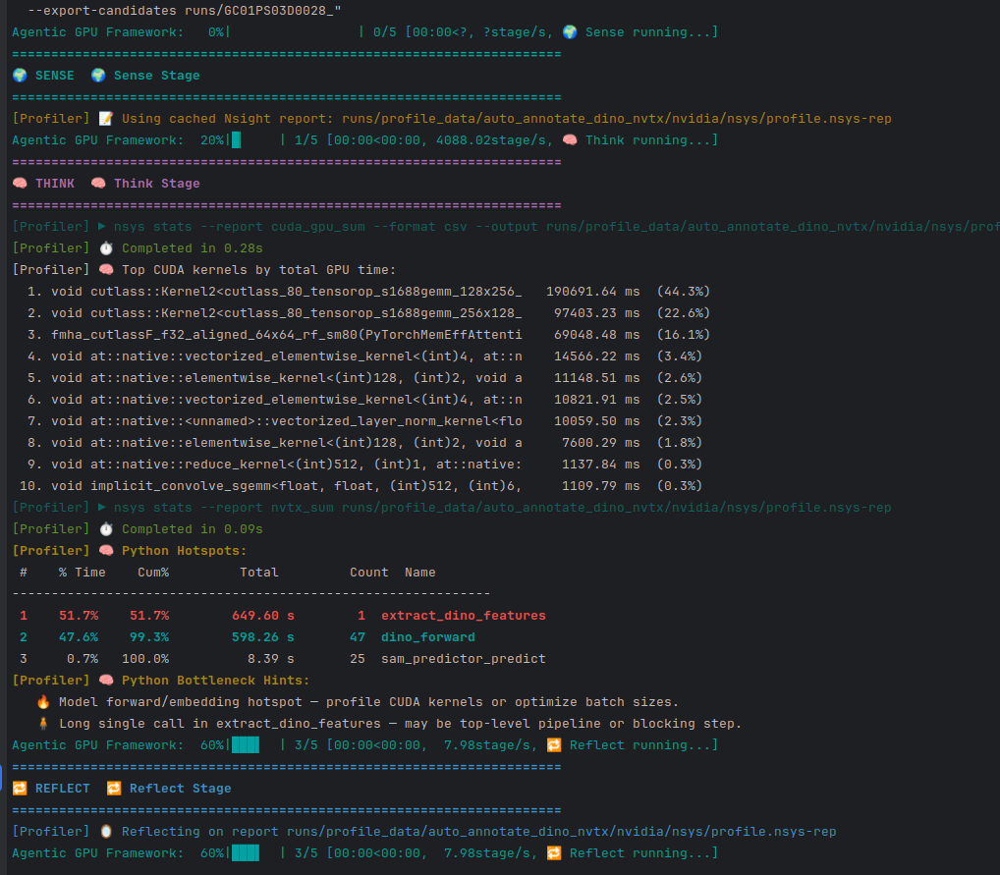
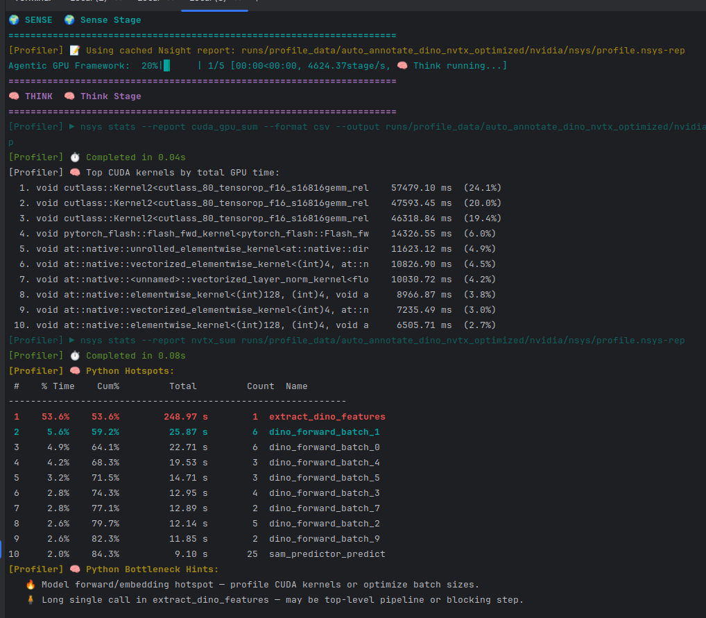
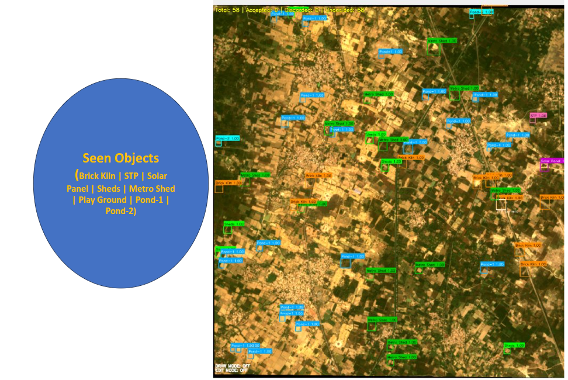
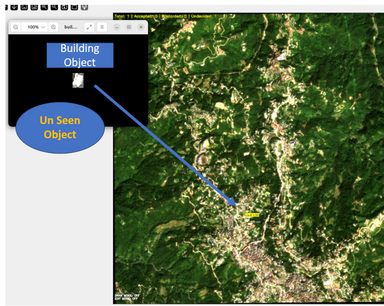

# ⚡ GeoAccel-AI: GPU-Optimized Geospatial Annotation

**Accelerating Geospatial Intelligence through distillation, segmentation, and proprietary embeddings.**  
Developed under the **SvarAikyam AI / AI Fusion** initiative, this project integrates deep visual distillation models, segmentation refinement, and GPU-accelerated feature search to automate large-scale annotation and object discovery in high-resolution (3m) satellite imagery.

---

## 🌍 Overview

**GeoAccel-AI** enables *automated detection, labeling, and visual search* across multi-band satellite datasets — empowering geospatial workflows through AI-driven similarity and segmentation refinement.  
The visual search can identify and classify diverse infrastructure and terrain categories with minimal human supervision.

Supported object classes:
> Brick Kiln | STP | Solar Panel | Sheds | Metro Shed | Play Ground | Pond-1 | Pond-2


### 🔹 Core Pipelines

| Stage | Description |
| ------ | ------------ |
| **Prototype Creation** | `create_features_dino.py` extracts DINOv2 feature vectors from annotated `.json` polygons (ground truth). |
| **Batch Prototype Builder** | `batch_create_dino_prototypes.sh` creates prototypes for all TIF + JSON pairs (101 in total across 8 classes). |
| **Auto-Annotation (GPU Optimized)** | `auto_annotate_dino_nvtx_optimized.py` performs window-based detection using DINOv2 embeddings, cosine similarity search, and SAM2 refinement for detected bounding boxes. |
| **Batch Detection** | `batch_auto_annotate_dino.sh` runs the optimized annotator across 150 images, detects all 8 object types, and saves bounding boxes in CSV format. |
| **Model Training** | YOLOv8 model trained on detected bounding boxes; used as a region proposal network (RPN) for refinement. |
| **Final Visual Search** | DINOv2 embeddings + cosine similarity label the new search regions to find query objects. |
| **Interactive Review UI** | `ui_review.py` enables OpenCV-based visual verification, class editing, and YOLO export. |                                            |

---
## Yolo Model Training 
Below are the metrics for a representative YOLOv8 model trained for 200 epochs.  
Since the extracted embeddings contain a degree of variability, moderate precision is expected — yet sufficient for rapid bootstrapping of geospatial datasets.

*Figure 1: YOLOv8 training loss curves over 200 epochs.*

## ⚙️ GPU Profiling & Agentic Optimization
Integrated with **Nsight Systems**, **Nsight Compute**, and **Torch Profiler** for kernel-level insights, enabling precise GPU workload tuning.
Includes experimental support for **Agentic GPU Optimization**, orchestrating autotuning of CUDA kernels and Triton ops for real-time efficiency gains on **RTX 3060** .


*Figure 2: Initial Profiling Report on RTX3060 (12GB).*


*Figure 3: Optimized Profiling Report on RTX3060 (12GB).*
---

## 🖼️ Results

<p align="center">
  <br>
  <em>Figure 4: Initial Annotation for Training.</em>
</p>

<p align="center">
  <br>
  <em>Figure 5: Final Result — Detected Known Objects in Unseen Image.</em>
</p>

<p align="center">
  <br>
  <em>Figure 6: Final Result — Detected Unseen Objects in Unseen Image.</em>
</p>

---


## 🧠 Research Context

**GeoAccel-AI** represents a unified, GPU-optimized geospatial AI framework that fuses:
- **Visual distillation** for semantic and texture representation
- **Segmentation refinement** for pixel-level precision
- **Agentic profiling & kernel discovery** for dynamic GPU efficiency

It serves as a bridge between **remote sensing**, **AI-driven automation**, and **edge-to-cloud scalability**, enabling faster Earth observation analytics and infrastructure monitoring.

---

## 📄 Citation

```
@misc{geoaccel_ai_2025,
  title  = {GeoAccel-AI: GPU-Optimized Auto-Annotation for Satellite Imagery},
  author = {Atul Vaish},
  year   = {2025},
  url    = {https://github.com/intelav/GeoAccel-AI}
}
```

---

© 2025 SvarAikyam AI | AI Fusion — Applied Research in GPU Optimization & Geospatial Intelligence


